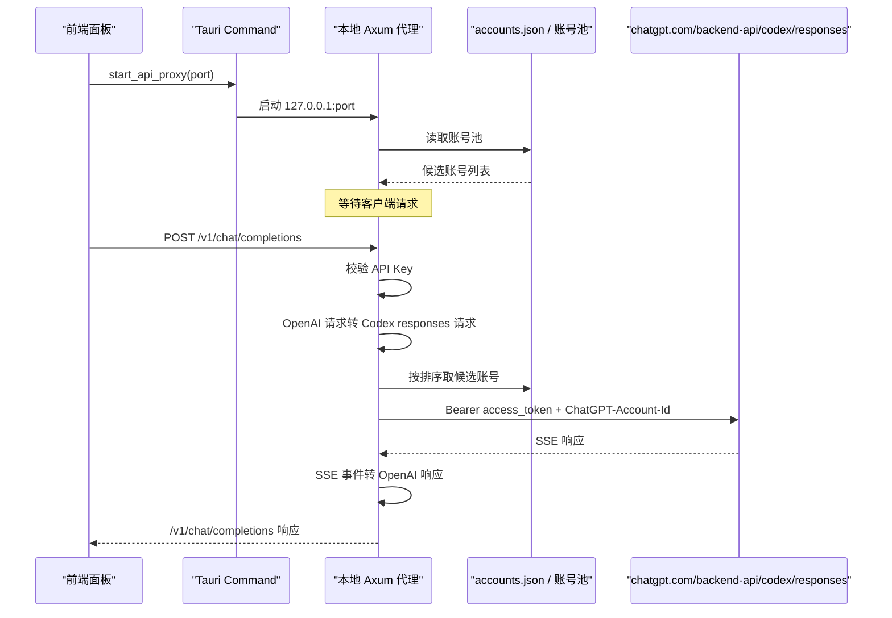

# API 反代链路说明

本文说明当前项目中的 API 反代实现。目标是让你从入口到上游返回，完整看懂这条链路现在是怎么工作的。

当前版本已经只保留一种反代方式：

- 本地对外暴露 OpenAI 兼容接口
- 上游统一转到 Codex 的 `chatgpt.com/backend-api/codex/responses`
- 不再保留旧的多模式反代
- Axum 请求体大小上限默认放宽到 `512 MiB`

实现参考了 `CLIProxyAPIPlus` 的 Codex executor 思路，但不是把它整仓搬进来，而是把核心方法收敛到本项目现有架构里。

## 1. 当前反代的定位

### 本地入口

- `GET /health`
- `GET /v1/models`
- `POST /v1/chat/completions`
- `POST /v1/responses`

### 上游入口

- `POST https://chatgpt.com/backend-api/codex/responses`

也就是说：

- 客户端以为自己在调用 OpenAI 风格的 `/v1/*`
- 实际上本地代理会把请求转换为 Codex `responses` 协议
- 然后用账号池中的 ChatGPT/Codex 登录态去访问上游

## 2. 为什么这样设计

之前的问题有两个：

- 直接打 `api.openai.com/v1/*` 时，很多导入的账号本质上只有 ChatGPT/Codex 登录态，不一定有公共 OpenAI API scope 或 quota
- 旧的 `conversation` 直通方式过于贴近历史接口，不适合作为稳定代理基座

现在的方案本质上是：

- 下游维持 `/v1` 兼容，方便接各种现成客户端
- 上游切到 Codex 当前更合适的 `responses` 入口
- 中间由本地代理负责协议转换

## 3. 整体时序



## 4. 入口与生命周期

### 4.1 前端触发

前端入口在：

- `/Users/zuozuo/Desktop/app/codex-tools/src/components/ApiProxyPanel.tsx`
- `/Users/zuozuo/Desktop/app/codex-tools/src/hooks/useCodexController.ts`

用户在面板点击“启动 API 反代”后：

1. 前端读取端口输入框
2. 调用 Tauri 命令 `start_api_proxy`
3. 成功后显示：
   - `Base URL`
   - `API Key`
   - 当前命中的账号
   - 最近错误

### 4.2 Tauri 命令

Tauri 命令入口在：

- `/Users/zuozuo/Desktop/app/codex-tools/src-tauri/src/lib.rs`

相关命令：

- `get_api_proxy_status`
- `start_api_proxy`
- `stop_api_proxy`

### 4.3 后端运行态

后端运行态在：

- `/Users/zuozuo/Desktop/app/codex-tools/src-tauri/src/state.rs`

这里维护：

- 监听端口
- 当前代理 API Key
- 运行任务句柄
- 当前命中的账号 ID/标签
- 最近一次错误

## 5. 启动时到底做了什么

启动逻辑在：

- `/Users/zuozuo/Desktop/app/codex-tools/src-tauri/src/proxy_service.rs`

`start_api_proxy_internal(...)` 做的事情是：

1. 检查当前是否已经有代理在运行
2. 从账号池加载可用账号
3. 绑定本地端口，默认 `8787`
4. 生成一个本地代理专用 `sk-...` API Key
5. 创建 `reqwest::Client`
6. 启动一个 `axum` HTTP 服务
7. 注册以下路由：
   - `/health`
   - `/v1/models`
   - `/v1/chat/completions`
   - `/v1/responses`
   - 对请求体启用 `512 MiB` 默认上限，可用 `CODEX_TOOLS_PROXY_MAX_BODY_MIB` 覆盖
8. 把运行状态写入全局 `AppState`

## 6. 本地暴露的接口

### 6.1 `GET /health`

用途：

- 用于判断本地代理服务是否活着

返回：

```json
{ "ok": true }
```

### 6.2 `GET /v1/models`

用途：

- 给兼容客户端一个模型列表

特点：

- 这里不是实时问上游拿模型
- 目前返回的是本地静态模型列表
- 目的是让大多数依赖 `/v1/models` 的客户端能正常初始化

### 6.3 `POST /v1/chat/completions`

用途：

- 兼容绝大多数 OpenAI Chat Completions 客户端

行为：

- 本地接收 OpenAI 风格请求
- 转为 Codex `responses` 请求
- 上游始终按 SSE 模式请求
- 如果下游请求 `stream: true`，本地再把上游 SSE 转成 OpenAI ChatCompletions SSE
- 如果下游请求 `stream: false`，本地会先收完整个 SSE，再拼成普通 JSON 返回

### 6.4 `POST /v1/responses`

用途：

- 给直接走 OpenAI Responses 风格的客户端使用

行为：

- 请求体不做大的协议改写，只做必要归一化
- 上游仍然统一发到 Codex `responses`
- `stream: true` 时近似透传 SSE
- `stream: false` 时从 SSE 中提取 `response.completed`，返回标准 JSON

## 7. 鉴权方式

本地代理有自己的一层鉴权，不直接暴露给任意本地程序。

支持两种传法：

- `X-API-Key: sk-...`
- `Authorization: Bearer sk-...`

校验逻辑：

- 只认启动代理时生成的那一个本地 `API Key`
- 这层 key 只是本地代理的门锁
- 它不是上游 OpenAI API Key
- 它也不是账号池里真实的 `access_token`

## 8. 账号池是怎么参与反代的

账号来源：

- `/Users/zuozuo/Library/Application Support/com.carry.codex-tools/accounts.json`

数据结构定义在：

- `/Users/zuozuo/Desktop/app/codex-tools/src-tauri/src/models.rs`

每个账号核心字段有：

- `label`
- `account_id`
- `auth_json`
- `usage`
- `plan_type`

代理真正需要的认证信息来自 `extract_auth(...)`：

- `access_token`
- `account_id`
- 可选 `plan_type`

## 9. 账号排序与挑选规则

候选账号在每次请求时重新读取，并重新排序，不做固定缓存。

排序规则：

1. 优先 `free` 账号
2. 再比较 `1week` 剩余额度
3. 再比较 `5h` 剩余额度
4. 最后按标签名排序

也就是：

- `free` 计划会优先于其他计划
- 在同一类计划中，优先挑“更有余量”的账号

对应逻辑：

- `load_proxy_candidates(...)`
- `compare_proxy_candidates(...)`

## 10. 请求发到上游时带了什么

真正向上游发请求时，目标是：

- `https://chatgpt.com/backend-api/codex/responses`

关键请求头：

- `Authorization: Bearer <candidate.access_token>`
- `ChatGPT-Account-Id: <candidate.account_id>`
- `Originator: codex_cli_rs`
- `Version: 0.101.0`
- `Session_id: <uuid>`
- `User-Agent: codex_cli_rs/0.101.0 (...)`
- `Accept: text/event-stream`
- `Content-Type: application/json`

这里有几个关键点：

- 不是发到 `api.openai.com/v1/*`
- 不是发到旧的 `conversation`
- 默认模拟的是 Codex CLI 风格头
- 上游固定按 SSE 返回

## 11. `chat/completions` 到 Codex `responses` 的转换

这是当前链路最核心的一层。

### 11.1 固定注入字段

本地会补这些字段：

- `stream: true`
- `store: false`
- `instructions: ""`
- `parallel_tool_calls: true`
- `reasoning.effort: medium`
- `reasoning.summary: auto`
- `include: ["reasoning.encrypted_content"]`

这里 `store: false` 很关键。

实际验证里，上游 `backend-api/codex/responses` 明确要求：

- 没带 `store: false` 会报错

### 11.2 message 角色映射

OpenAI 风格消息会被转换为 Codex `input` 数组。

角色映射：

- `system -> developer`
- `developer -> developer`
- `user -> user`
- `assistant -> assistant`
- `tool -> function_call_output`

### 11.3 content 映射

文本：

- `text -> input_text` 或 `output_text`

图片：

- `image_url -> input_image`

文件：

- `file -> input_file`

### 11.4 tool 调用映射

OpenAI 里的：

- `assistant.tool_calls`
- `tool` 消息

会被拆成 Codex 里的：

- `function_call`
- `function_call_output`

### 11.5 结构化输出映射

如果下游传了：

- `response_format`
- `text.verbosity`

本地会转换到上游的：

- `text.format`
- `text.verbosity`

## 12. `/v1/responses` 的归一化

如果下游直接请求 `/v1/responses`，本地不会像 `chat/completions` 那样大幅转换，只做必要补丁：

- 强制 `stream: true`
- 强制 `store: false`
- 缺失时补 `instructions`
- 缺失时补 `parallel_tool_calls`
- 缺失时补 `reasoning.effort = medium`
- 缺失时补 `reasoning.summary = auto`
- 确保 `include` 里有 `reasoning.encrypted_content`

## 13. 上游 SSE 是怎么转回 OpenAI 的

### 13.1 `POST /v1/responses`

如果下游本来就是 Responses 客户端：

- `stream: true` 时，基本按 SSE 透回去
- `stream: false` 时，从完整 SSE 中提取 `response.completed`

### 13.2 `POST /v1/chat/completions`

这是转换最多的地方。

上游返回的是 Codex SSE 事件流，本地会把关键事件转成 OpenAI ChatCompletions SSE。

#### 事件映射

| 上游事件 | 本地输出 |
| --- | --- |
| `response.created` | 初始化状态，不立即输出 |
| `response.reasoning_summary_text.delta` | `delta.reasoning_content` |
| `response.reasoning_summary_text.done` | 补一个换行分隔 |
| `response.output_text.delta` | `delta.content` |
| `response.output_item.added` with `function_call` | `delta.tool_calls` 开始事件 |
| `response.function_call_arguments.delta` | `delta.tool_calls[].function.arguments` 增量 |
| `response.function_call_arguments.done` | 参数结束兜底 |
| `response.output_item.done` with `function_call` | 工具调用完成兜底 |
| `response.completed` | `finish_reason` + `[DONE]` |

#### 非流式时怎么处理

如果下游 `stream: false`：

1. 本地仍然向上游请求 SSE
2. 读完整个 SSE
3. 找到 `response.completed`
4. 从 `response.output` 里提取：
   - assistant 文本
   - reasoning summary
   - tool calls
   - usage
5. 拼成一个普通的 OpenAI ChatCompletions JSON

## 14. 失败重试与自动切号

每次请求会按候选账号顺序尝试。

对单个账号的流程：

1. 先用当前 token 发上游请求
2. 如果命中“疑似 token 过期/失效”信号，则先 refresh
3. refresh 成功后重试这个账号一次
4. 如果仍失败，再判断是否属于可切下一个账号的错误

### 14.1 会触发 refresh 的情况

- `401`
- 错误体包含：
  - `token expired`
  - `jwt expired`
  - `invalid token`
  - `session expired`
  - `login required`

### 14.2 refresh 成功后还会做什么

刷新成功后会把新的认证状态写回两处：

- 账号池里的 `accounts.json`
- 如果它正好是当前激活账号，也会回写 `~/.codex/auth.json`

## 15. 失败分类

如果某个账号失败，本地会尽量分类，而不是只报一个泛泛的 `429`。

当前分类：

- `额度用完`
- `频率限制`
- `模型受限`
- `鉴权失败`
- `权限不足`

当所有候选账号都失败时，会返回类似：

- 哪一类失败有多少个
- 再附一个示例原因

这样你能更快判断是：

- 账号整体没额度
- 当前模型不支持
- 还是登录态坏了

## 16. 最近错误和当前账号是怎么展示的

运行中的状态会保存在：

- `ApiProxyRuntimeSnapshot`

主要字段：

- `active_account_id`
- `active_account_label`
- `last_error`

前端轮询这些状态，所以面板上能看到：

- 当前命中的账号
- 最近一次错误

## 17. Cloudflared 和反代的关系

Cloudflared 不是第二套代理逻辑，它只是把当前本地代理继续暴露到公网。

关系是：

1. 本地 API 反代先启动
2. Cloudflared 再把这个本地端口转出去

所以链路是：

```text
客户端 -> cloudflared 公网地址 -> 本地 127.0.0.1:8787/v1/* -> Codex 上游
```

Cloudflared 不参与：

- 请求协议转换
- 账号挑选
- token refresh
- SSE 到 OpenAI 的映射

它只负责公网入口。

## 18. 为什么没有用 `responses/compact`

当前实现统一走：

- `backend-api/codex/responses`

没有走：

- `backend-api/codex/responses/compact`

原因是实际验证里：

- `/responses` 是当前主路径，SSE 和普通返回都能靠它做出来
- `/responses/compact` 在部分情况下兼容性不稳定
- 当前项目先追求稳定链路，不再引入第二条上游分支

## 19. 当前的边界与限制

当前版本不是“完整 OpenAI API 网关”，而是“OpenAI 兼容的 Codex 代理”。

明确限制：

- 只支持：
  - `GET /v1/models`
  - `POST /v1/chat/completions`
  - `POST /v1/responses`
- 其他 `/v1/*` 路径目前直接返回不支持
- 模型列表是本地静态表，不是实时探测
- `/v1/responses` 的流式是近似透传，不额外做深层语义改写
- 核心目标是把最常用的聊天链路稳定打通

## 20. 代码位置索引

如果你要继续看代码，优先看这些文件：

- 启动、路由、转换、账号轮换：
  - `/Users/zuozuo/Desktop/app/codex-tools/src-tauri/src/proxy_service.rs`
- Tauri 命令：
  - `/Users/zuozuo/Desktop/app/codex-tools/src-tauri/src/lib.rs`
- 运行态：
  - `/Users/zuozuo/Desktop/app/codex-tools/src-tauri/src/state.rs`
- 账号结构：
  - `/Users/zuozuo/Desktop/app/codex-tools/src-tauri/src/models.rs`
- 前端面板：
  - `/Users/zuozuo/Desktop/app/codex-tools/src/components/ApiProxyPanel.tsx`
- 前端控制器：
  - `/Users/zuozuo/Desktop/app/codex-tools/src/hooks/useCodexController.ts`
- 调试脚本：
  - `/Users/zuozuo/Desktop/app/codex-tools/scripts/test-codex-login-proxy.mjs`

## 21. 一个完整请求示例

以这个调用为例：

```bash
curl http://127.0.0.1:8787/v1/chat/completions \
  -H 'Content-Type: application/json' \
  -H 'Authorization: Bearer sk-xxxx' \
  -d '{
    "model": "gpt-5",
    "stream": false,
    "messages": [
      { "role": "user", "content": "1+1 等于几？只回答结果。" }
    ]
  }'
```

内部实际流程是：

1. 本地校验 `sk-xxxx`
2. 找到可用账号列表
3. 把请求改写成 Codex `responses` 请求
4. 强制补 `store: false`
5. 带着账号 `access_token + account_id` 去打上游
6. 上游返回 SSE
7. 本地抽取 `response.completed`
8. 转成 OpenAI ChatCompletions JSON
9. 返回类似：

```json
{
  "object": "chat.completion",
  "choices": [
    {
      "message": {
        "role": "assistant",
        "content": "2"
      },
      "finish_reason": "stop"
    }
  ]
}
```

## 22. 调试方式

### 看服务是否起来

```bash
curl http://127.0.0.1:8787/health
```

### 看模型列表

```bash
npm run test:codex-login-proxy -- --api-key 你的sk
```

### 看聊天结果

```bash
npm run test:codex-login-proxy -- --api-key 你的sk --prompt '1+1 等于几？只回答结果。'
```

### 保留原始响应

```bash
npm run test:codex-login-proxy -- --api-key 你的sk --prompt '1+1 等于几？只回答结果。' --raw
```

这会把：

- 响应头
- 原始 body
- 请求元数据

都落到本地文件，方便继续排查。

## 23. 一句话总结

当前反代的本质是：

- 本地对客户端说“我是 OpenAI `/v1`”
- 对上游实际上说“我是 Codex CLI，在调用 `backend-api/codex/responses`”
- 中间靠账号池、协议转换、SSE 事件转换，把两边接起来
